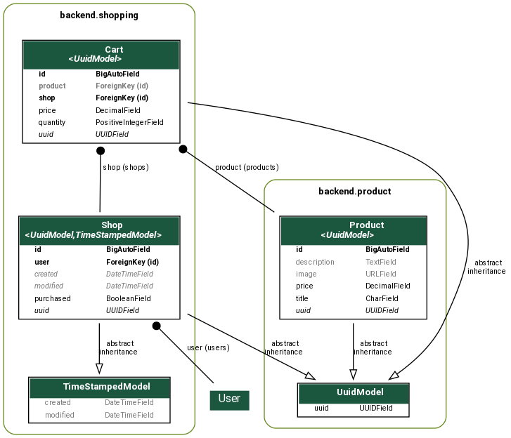
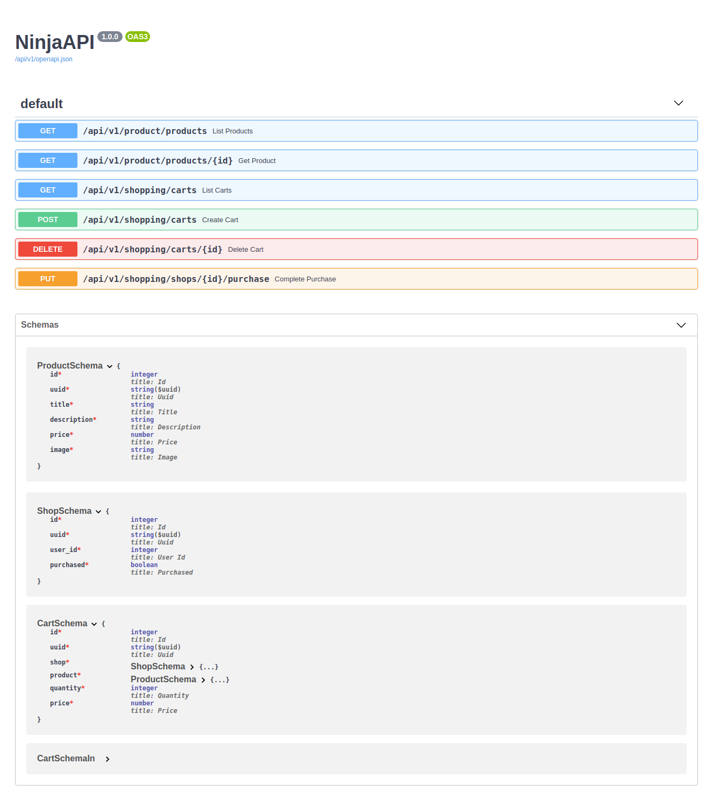

# DFT Challenge

# Automation Team - Technical Challenge

Read [challenge](challenge.md)

## This project was done with:

* [Python 3.8.9](https://www.python.org/)
* [Django 3.2.2](https://www.djangoproject.com/)
* [Django Ninja](https://django-ninja.rest-framework.com/)
* [VueJS 2.6.11](https://vuejs.org/)

> pytest in the final of README.md


## Models



Read more [Visualizando seus modelos com Graph Models](https://github.com/rg3915/dicas-de-django#36---django-visualizando-seus-modelos-com-graph-models)

## How to run project?

### Running with Docker

```
git clone https://github.com/rg3915/automation-team-store-challenge.git
# After merge branch develop-rg3915 to master...
cp contrib/env_sample .env
docker-compose up --build -d
```

Run more commands:

```
# To createsuperuser
docker container exec -it dft_app python manage.py createsuperuser --username="admin" --email="admin@email.com"

# To load data
docker container exec -it dft_app python manage.py create_data

# To create token
docker container exec -it dft_app python manage.py drf_create_token admin

# To collectstatic (optional)
docker container exec -it dft_app python manage.py collectstatic --no-input
```


## Docs swagger

http://0.0.0.0:8000/api/v1/docs


POST: Add to cart

```
{
    "user_id":1,
    "product_id":1,
    "quantity":2
}
```



## Admin

http://0.0.0.0:8000/admin


## pytest

Run pytest on local machine, without Docker.

Edit `.env`, add this line

```
DOCKER=False
```

### Run backend

```
# go to principal folder
python -m venv .venv
source .venv/bin/activate
pip install -r requirements.txt
python manage.py migrate

# Finally run pytest
pytest
```
